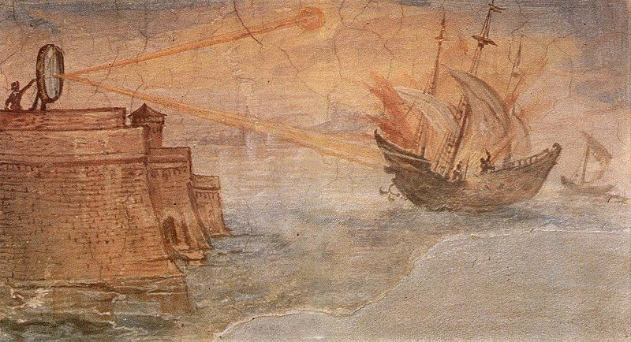

```{r include=FALSE}
library(RefManageR)
library(knitcitations)
BibOptions(check.entries = FALSE,
           bib.style = "authoryear",
           cite.style = "authoryear",
           style = "markdown",
           hyperlink = TRUE,
           dashed = FALSE,
           no.print.fields=c("doi", "url", "urldate", "issn"))
myBib <- ReadBib("./references.bib", check = FALSE)

```

```{r xaringan-themer, include=FALSE, warning=FALSE}
library(xaringanthemer)
style_mono_accent(
  base_color = "#063d76",
  header_font_google = google_font("Josefin Sans"),
  text_font_google   = google_font("Montserrat", "300", "300i"),
  code_font_google   = google_font("Fira Mono")
)
```

# Summary 1: LiDAR

.pull-left[* Remote sensing technology that uses laser pulses to measure distances to objects i.e., active sensor.
* Emits laser beams and measures the time it takes for the light to bounce back, creating detailed 3D maps of the surrounding environment.
* Commonly used for terrain mapping, vegetation analysis, urban planning, autonomous vehicles, archaeological surveys, forestry management, military and defence, aviation, mining, quarrying, to name a few .]

```{r echo=FALSE, out.width= "50%", fig.show='hold', fig.align= 'right', fig.cap= "A lidar map of Lynnhaven Inlet, Virginia (Source: NOAA, 2023)"}


```
---

# Summary 2: LiDAR

A quick journey back in time:
* Archimedes' use of mirrors during the Siege of Syracuse in 212 BC, reflecting sunlight to ignite enemy ships, foreshadowed Lidar's foundation, known as "light amplification by stimulated emission of radiation" (LASER).
* The 1960 invention of the laser revolutionised rangefinding, enabling Hughes Aircraft Company researchers in 1962 to pioneer Lidar's first distance-measuring system. Utilising a ruby laser, this system emitted light pulses reflected back from target objects, facilitating precise distance calculations based on pulse travel time.  `r Citep(myBib, "pointscanWhatLiDARHistory2023")`

```{r echo=FALSE, out.width= "40%", fig.show='hold', fig.align= 'center', fig.cap= "Artistic depiction of Archimedes' mirror employed in burning Roman ships. Painting by Giulio Parigi, c. 1599. Image: public domain"}


```
---

# Summary 3: LiDAR

* A lidar device primarily comprises a laser, a scanner, and a dedicated GPS receiver. 
* Aircraft and helicopters serve as the primary platforms for gathering lidar data across extensive regions.
* Lidar technology encompasses two main types:
  * topographic - employs a near-infrared laser to chart terrestrial landscapes;
  * bathymetric - utilises water-permeating green light to measure both underwater and riverbed elevations.
  `r Citep(myBib, "noaaWhatLidar2023")`

```{r echo=FALSE, out.width= "50%", fig.show='hold', fig.align= 'center', fig.cap= "Collecting LiDAR data from an aircraft (Source: Van Der Schriek and Beex, 2017)"}

knitr::include_graphics('airplane.png')
```
---

# Applications 1: Terrain mapping

* Lidar provides detailed topographic data by measuring surface elevation with high precision.
* It enables the creation of digital elevation models (DEMs) `r Citep(myBib, "sarithaDigitalElevationModel2021")` and digital terrain models (DTMs) for terrain mapping.
* The technology penetrates vegetation, allowing for accurate mapping of terrain beneath forest canopies.
* Lidar data aids in identifying landforms `r Citep(myBib, "gokgozLargeScaleLandform2015")`, analysing slope characteristics `r Citep(myBib, "yangApplicationValidationModel2018")`, and assessing terrain suitability for various purposes `r Citep(myBib, "millardUseGISHigh2013")`.

---

# Applications 2: Vegatation analysis

* Lidar captures detailed information about vegetation structure, including canopy height, density, and distribution.
* It enables the creation of vegetation maps and biomass estimation, crucial for ecological studies and forest management.
* The technology facilitates monitoring of forest health, detecting changes in vegetation cover, and assessing habitat quality.
* Lidar data aids in identifying tree species `r Citep(myBib, "HangZhouShiFanDaXueYaoGanYuDiQiuKeXueYanJiuYuanFusedAirborneLiDAR2013")`, analysing canopy gaps `r Citep(myBib, "nowakHiddenGapsCanopy2022")`, and assessing the impact of disturbances on vegetation `r Citep(myBib, "novoAutomaticProcessingAerial2020")`.

---

# Applications 3: Urban planning

* Lidar supports urban planning by providing precise 3D mapping of urban environments, including buildings, roads, and infrastructure.
* It enables the creation of detailed digital surface models (DSMs) and digital terrain models (DTMs) for urban landscape analysis.
* The technology aids in land use classification, transportation network planning, and infrastructure maintenance.
* Lidar data facilitates flood risk assessment `r Citep(myBib, "bodoqueDevelopingReliableUrban2023")`, urban growth monitoring `r Citep(myBib, "hameedUrbanizationDetectionUsing2022")`, and green space planning in urban areas `r Citep(myBib, "pysznyLiDARBasedUrban2020")`.

---

# Applications 4: Archeological surveys

* Lidar aids archaeological surveys by providing detailed topographic data of landscapes, uncovering hidden features.
* It allows for the detection of archaeological sites, ancient structures, and artifacts that may be obscured by vegetation or terrain.
* The technology accelerates the mapping process, covering large areas efficiently and identifying potential excavation sites.
* Lidar assists in reconstructing ancient landscapes `r Citep(myBib, "partonUsingLidarBayesian2022")`, understanding settlement patterns `r Citep(myBib, "fisherIdentifyingAncientSettlement2016")`, and planning targeted excavations for further study.

---

# Reflections

- It was fascinating to learn just in how many fields and how widely across each one of them LiDAR collected data can be applied. 
- I found it so interesting how LiDAR can create highly detailed 3D maps of terrain and objects, even through vegetation!
- Goggling LiDAR and constantly seeing results from *Amazon* website was an interesting way of learning just how accessible, compact, and affordable this type of technology has become to the general public since it was first used in the 1960s.
- The accuracy of LiDAR measurements is so precise that it can detect changes in ground elevation as small as a few centimeters! If that is not impressive, I don't know what is.
- As someone who spent their childhood obsessing about the (Seven) Wonders of the World, learning that LiDAR technology has been used to discover lost cities and ancient civilisations, such as the Maya ruins in Central America and Angkor Wat in Cambodia, that was like coming full circle.

---
# References
<small>
<small>
<small>
```{r results='asis', echo = FALSE}
PrintBibliography(myBib)
```
</small>
</small>
</small>